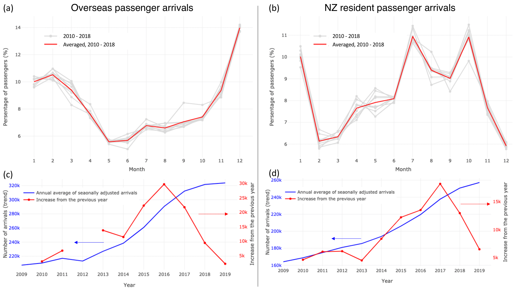
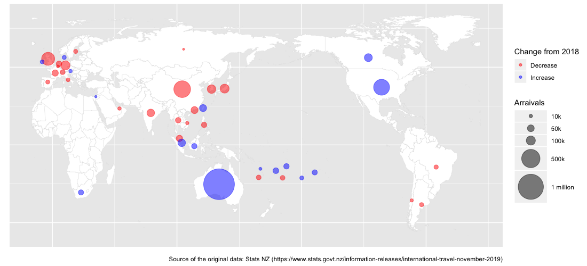

# R - Analysis of oveseas and residence arrivals in NZ
This is a personal project to process and visualise data in R. The source data is obtained from the International Travel release on the Stats NZ's website https://www.stats.govt.nz/information-releases/international-travel-november-2019. 

The analysis of monthly and annual trend is done for both overseas visitors and residence travellers in NZ. Sample iamges generated in this script are shown below.

## Seasonal and Annual Trend
Figure (a, b) shows the seasonal variability of the overseas visitors (a) and NZ residence travellers (b). Figure (c, d) shows annual trend (blue line) with increase of the number of arrivals from the last year (red line) for overseas visitors (c) and NZ residence travellers (d).  

sourceof the original data: Stats NZ – The international travel release (https://www.stats.govt.nz/information-releases/internationaltravelnovember-2019)

## Overseas Travellers by Country
The world map shown below shows the number of overseas visitors from the top 41 countiries in the year 2019 while comparing with the number of visitors in 2018. The size of bubble and colour represent the number of arriavlas and change from 2018 (blue: increase, red: decrease), respectively.

